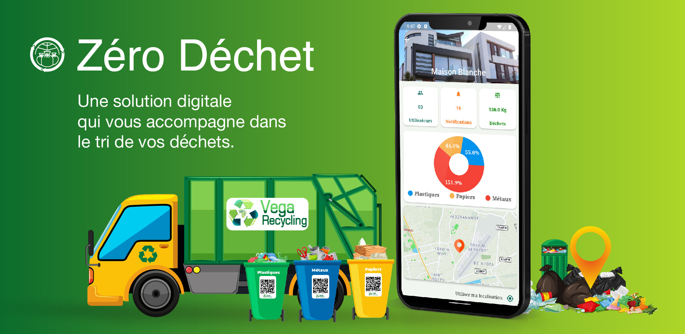
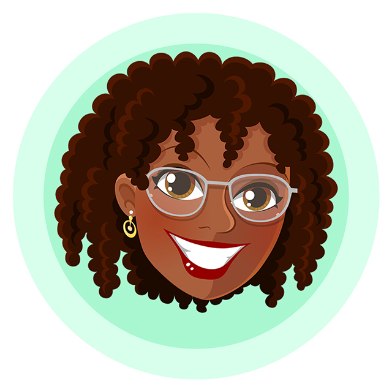
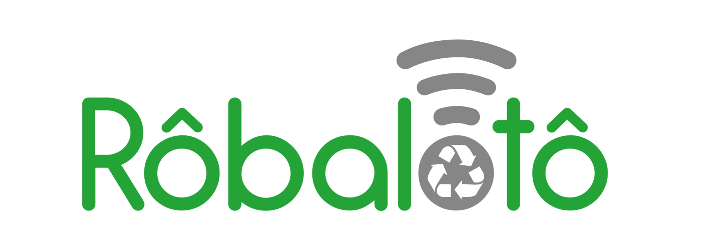

# 👋 Hi, I'm Bradlab

Welcome to my GitHub profile! I'm a **fullstack developer** passionate about building **innovative solutions**, **intuitive user interfaces**, and **scalable architectures**.  
I enjoy working on projects that combine **social impact**, **technology**, and **user experience**.

# 💫 About Me:

🔭 Currently working on some exciting DevOps projects
 🌱 Deeply passionate about DevOps, automation, and building scalable systems
 💻 Strong background in JavaScript, with a focus on backend development using NestJS
 🤖 I leverage AI tools to move faster, stay efficient, and focus on high-impact tasks
 👥 Actively exploring technical leadership and team management
 👯 I’m looking to collaborate on NestJs, FastAPI projects
 ⚡ Fun fact: I’m team tabs — always.

---

## 💼 Some Projects

<table>
  <tr>
  <td align="center" width="300" style="border-radius: 15px; border: 1px solid #ddd; padding: 20px; margin: 10px; vertical-align: top; box-shadow: 2px 2px 5px rgba(0, 0, 0, 0.1);">
      
    <h3>Zéro Déchet</h3>
    

      A mobile application that helps users sort and manage their household waste. Users can practice selective sorting based on our guidelines, earn points that convert into a reward fund, and even turn their waste into a secondary source of income.
       <a href="https://play.google.com/store/apps/details?id=com.zerodechet.app">Download on PlayStore</a>
    

  </td>
  <td align="center" width="300" style="border-radius: 15px; border: 1px solid #ddd; padding: 20px; margin: 10px; vertical-align: top; box-shadow: 2px 2px 5px rgba(0, 0, 0, 0.1);">
      
    <h3>DacPharma</h3>
    

      A chatbot developed to provide the population with access to pharmacies at any time of the day or night. It is available on WhatsApp and Telegram.
       <a href="https://dph.page.link/dph">Access on WhatsApp</a>
    

  </td>
  <td align="center" width="300" style="border-radius: 15px; border: 1px solid #ddd; padding: 20px; margin: 10px; vertical-align: top; box-shadow: 2px 2px 5px rgba(0, 0, 0, 0.1);">
      
    <h3>Rôbalôtô</h3>
    

      A project aimed at educating students on environmental protection and equipping schools with tools for better management of their plastic waste. The project's vision is to achieve zero plastic waste in Togo by 2027 by reaching schools, markets, households, and businesses.
       <a href="https://eco-citoyennete.org/">Learn more</a>
    

  </td>
  </tr>
</table>

---

## 🔧 Tech Stack

**Languages & Frameworks**  

**Backend**  

**Frontend & Mobile**  

**Other Tools**  

---

## 📫 Connect with Me

Let's get in touch:  

---

## 🚀 Projects Worth Exploring

- 🌍 Social and environmentally impactful apps  
- 🤖 Smart chatbots with **Dialogflow**  
- 📱 Modern and performant **Flutter** mobile apps  
- 💻 Fullstack platforms using **Next.js + NestJS**

---

Thanks for stopping by! Feel free to explore my repositories and connect with me. 😊
